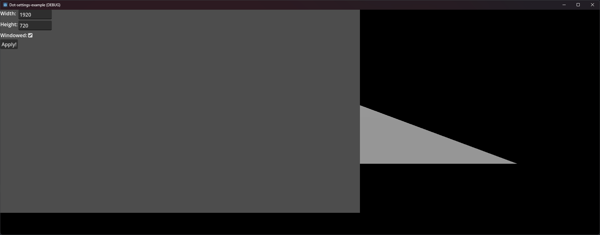

This is a small [Godot](https://godotengine.org) game that showcases a simple 2D settings menu in a 3D environment. The settings menu includes three user options for changing the game window's width, height, and mode (e.g. full screen or windowed).

Settings are retrieved from a file on disk in JSON format. When the "Apply" button is clicked, the current settings are saved to the file on disk.

**Note** While in game, you can use the escape key to toggle the 2D menu.

## General Settings
Here's a table of general settings the script uses.

| Name | Default | Description |
| ---- | ------- | ----------- |
| Default Width | `1920` | The default screen width. |
| Default Height | `1080` | The default screen height. |
| Default Windowed | `true` | Whether to run windowed mode by default. |
| Settings Path | `./settings.json` | A path to the settings file on disk. |

## Images

## Credits
* [Christian Deacon](https://github.com/gamemann)